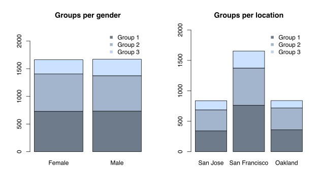

# Clustering users of a telecommunication company

This analysis focuses on clustering users from a telecommunication company based on their **mobile phone usage**. Based on this clustering, it is possible to extract valuable information about the users' behaviour and preferences per group.

## Installation

Use the packages

```bash
packs<-c("caTools","ggplot2","corrgram","HDclassif","cluster","mclust","FactMixtAnalysis","nnet","class","tree","pbkrtest","quantreg")

install.packages(packs)


```


# Data

The dataset consists of 3333 users living in California and their usage characteristics like:
- phone calls and minutes in different periods of the day or in international networks
- voicemail messages
- customer service calls
- gender
- city dial codes

## Methods

For the analysis **K- means**  and **Hierarchical** clustering will be used.

## Results

After discarding information like customer service calls and transforming some variables, the most promising clustering was generated by having two variables:

- the international network call minutes
- the ration of day towards night call minutes with this transformation:

K-means and Hierarchical had similar Silhouette* index, but K-means showed better visual results with 3 possible groups. 

>**Note:**The Silhouette index fluctuates between -1 and 1 and shows how well the observations are adapted to the respective groups.


### Clustering plot with K-means

 

### Results regarding the plot
- The mean value of international calls is 10 minutes, so from the plot it is obvious that blue groups speaks more than 10 minutes, while red group less than 10 minutes.
- While the ration of day over night minutes is close to 1, blue and red groups are below average and so they speak more at night. Otherwise, green time speaks more during the daytime.

These results are more obvious in the next plots, where the characteristics per group are depicted:


 

 


 